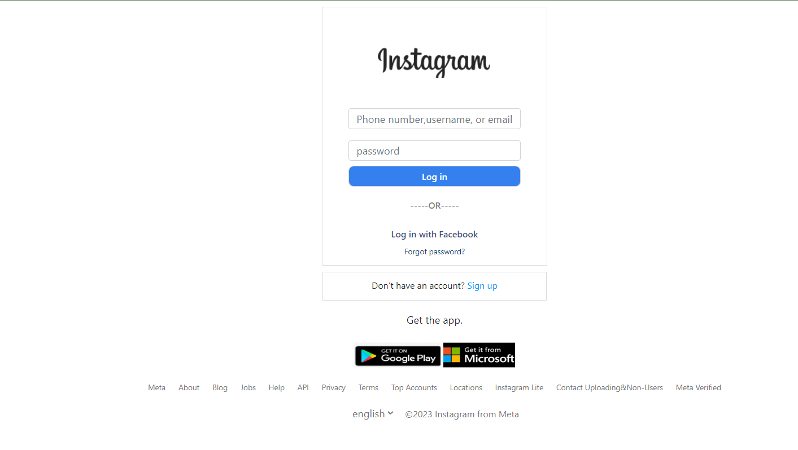

# Instagram Login Page Template 🖥️

This project is a simple Instagram Login Page clone built using HTML and CSS. The purpose of this template is to replicate the design of Instagram’s login interface for learning and practice purposes.

---

## Demo:

[Demo](https://naveenkumar-developer.github.io/instagramLogin-page/)

---

## Features 🚀

- Responsive design for desktop and mobile devices.

- Clean and modern UI similar to Instagram.

- Simple CSS styling without any frameworks.

- Placeholder links for login and sign-up buttons.

--- 

## Technologies Used 🛠️

- HTML5 – Structure of the page.

- CSS3 – Styling the UI and layout

